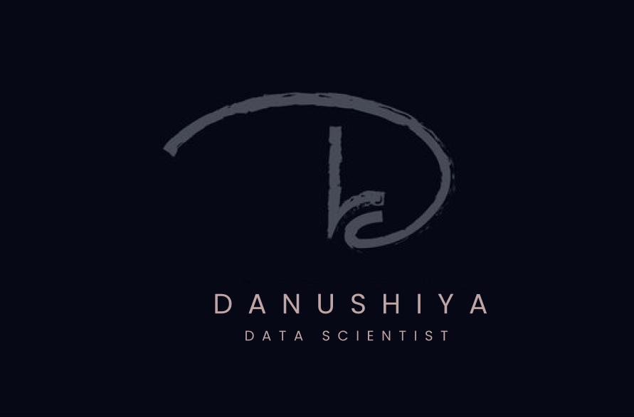

<h1 align="center">Hi 👋🏻, I'm Danushiya</h1>
<h3 align="center">A Passionate Backend Developer</h3>

I am fascinated by how computer technology 🌐 has brought changes to our lives
 that could never have been predicted; witnessing the expansion of computer science allowed me to
 consider studying software engineering from an
 early age, and my enthusiasm has perpetually developed since this time.
 And also I love exploring new tech stack 💻 and leveraging them to build cool stuffs 🛠️

 
  
<!--   -->

  
  
  
  

 

  
  
  
  

  

- 🔭 I have Worked as a Python Development Intern at **TechnoHack Edutech**

- 🌱 I’m currently learning **R**

- 👨‍💻 All of my projects are available at [Danu's workspace](https://github.com/Danushiya)

- 💬 Ask me about **Python, AI and Mobile Application**

- 📫 Feel free to reach out to me **danushiyakitty@gmail.com**

- ⚡ Fun fact **I believe I'm Hilarious!😆**

 
<h3 align="left">Connect with me:</h3>

 

<h3 align="left">Languages and Tools:</h3>

- Backend

  

- Frontend

  

- Database

  

- Cloud Servers

  

- Tools

  

 

<h3 align="left">Activity:</h3>

  

<h3 align="left">Achievements:</h3>

I am honored to have secured a <strong>Top 20</strong> position in the esteemed <strong>Tamil Nadu Coders Premier League (NM-AU-TNcpl)</strong>

   

 <em><b>I love connecting with different people</b> so if you want to say <b>Hi, I'll be happy to meet you more!</b> :)</em>

 

 Created with 🧡 by <a href="https://www.linkedin.com/in/danushiya/">Danushiya</a>

